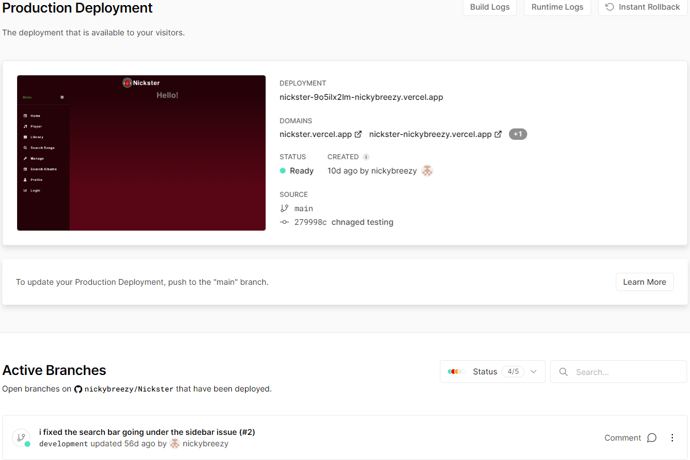

# Portfolio of my individual work in semester 3
Nicky Tabrizifar
Class: S3-DB01
Teachers: Samuil Angelov and Jean Paul Ligthart

## My Deployed Website
- Vercel: https://nickster.vercel.app/
- Git Repository: https://github.com/Individueel-Nicky/NicksterBackupFinal
- Research Report: https://github.com/nickybreezy/Nickster/blob/main/researchreport.md
---
## Table of contents
- [Portfolio of my individual work in semester 3](#portfolio-of-my-individual-work-in-semester-3)
  - [My Deployed Website](#my-deployed-website)
  - [Table of contents](#table-of-contents)
  - [1. Introduction](#1-introduction)
  - [2. Learning Outcomes](#2-learning-outcomes)
  - [3. Research](#3-research)
    - [3.1. Cultural differences](#31-cultural-differences)
    - [3.1.1. Introduction](#311-introduction)
    - [3.1.2. What is culture?](#312-what-is-culture)
    - [3.1.3. Which are well-known dimensions on cultural differences?](#313-which-are-well-known-dimensions-on-cultural-differences)
    - [3.1.4. Personal experiences with cultural differences](#314-personal-experiences-with-cultural-differences)
  - [3.2. Ethics](#32-ethics)
    - [3.2.1 Programming Ethical Guidelines](#321-programming-ethical-guidelines)
    - [3.2.2 Why are ethics important in software engineering?](#322-why-are-ethics-important-in-software-engineering)
    - [3.2.3 What do you have to do as a software engineer to address ethical aspects in your work?](#323-what-do-you-have-to-do-as-a-software-engineer-to-address-ethical-aspects-in-your-work)
    - [3.2.4 Ethics analysis for group project](#324-ethics-analysis-for-group-project)
    - [3.2.5 Ethical conflicts \& soltions](#325-ethical-conflicts--soltions)
    - [3.2.6 Ethics analysis for individual project](#326-ethics-analysis-for-individual-project)
  - [3.3. Agile methods](#33-agile-methods)
    - [3.3.1 What is Agile?](#331-what-is-agile)
    - [3.3.2 Scrum](#332-scrum)
    - [3.3.3 Kanban](#333-kanban)
    - [3.3.4 For the group project](#334-for-the-group-project)
    - [3.3.5 For my individual project](#335-for-my-individual-project)
  - [3.4. Business processes](#34-business-processes)
    - [3.4.1 Introduction](#341-introduction)
    - [3.4.2 The role of software applications in business processes](#342-the-role-of-software-applications-in-business-processes)
    - [3.4.3 Examples of business processes](#343-examples-of-business-processes)
  - [3.5 Research Reports](#35-research-reports)
    - [3.5.1 Insecure Design](#351-insecure-design)
    - [3.5.2 The Impact of Cultural Differences and Ethics](#352-the-impact-of-cultural-differences-and-ethics)
  - [3.6 CI/CD](#36-cicd)
    - [3.6.1 What is CI/CD](#361-what-is-cicd)
    - [3.6.2 Applying CI/CD and Testing to my own project](#362-applying-cicd-and-testing-to-my-own-project)
      - [CI/CD](#cicd)
      - [Code scans](#code-scans)
  - [4. Group Project (The Parking Pals)](#4-group-project-the-parking-pals)
    - [4.1 Strategy](#41-strategy)
    - [4.2 Design choice](#42-design-choice)
    - [4.3 Software Design](#43-software-design)
    - [4.4 Software Architecture](#44-software-architecture)
    - [4.5 Behind the Project](#45-behind-the-project)
  - [5. Individual Project (Nickster)](#5-individual-project-nickster)
    - [5.1 Design choice](#51-design-choice)
    - [5.2 Software Design](#52-software-design)
    - [5.3 Usability Test](#53-usability-test)
    - [5.1 UX design process](#51-ux-design-process)
    - [5.2 Different types of UX testing](#52-different-types-of-ux-testing)
    - [5.3 Manual testing my own project](#53-manual-testing-my-own-project)
        - [Conclusion](#conclusion)
  - [6. Sources](#6-sources)

## 1. Introduction

Welcome to my software development portfolio! I'm currently in my third semester at Fontys ICT & Software Engineering. This portfolio showcases how I have gone through the learning outcomes using my recent work, including research reports, individual and group projects, and reflections on my learning journey. I hope you enjoy reading through my work, and please feel free to contact me if you have any questions or would like to discuss a project.

## 2. Learning Outcomes

| #   | Name                            | Short description                                                                                                                           | Clarification                                                                                                                                                                                                                                                                                                                                                                                                                                                    |
| --- | ------------------------------- | ------------------------------------------------------------------------------------------------------------------------------------------- | ---------------------------------------------------------------------------------------------------------------------------------------------------------------------------------------------------------------------------------------------------------------------------------------------------------------------------------------------------------------------------------------------------------------------------------------------------------------- |
| 1   | Web application                 | You design and build **user-friendly, full-stack** web applications.                                                                        | **User friendly:** You apply basic User experience testing and development techniques. **Full-stack:** You design and build a full stack application using commonly accepted front end (JavaScript-based framework) and back end techniques (e.g. Object Relational Mapping) choosing and implementing relevant communication protocols and addressing asynchronous communication issues.                                                                     |
| 2   | Software quality                | You use software **tooling and methodology** that continuously monitors and improve the software quality during software development.       | **Tooling and methodology:** Carry out, monitor and report on unit integration, regression and system tests, with attention for security and performance aspects, as well as applying static code analysis and code reviews.                                                                                                                                                                                                                                     |
| 3   | Agile method                    | You **choose** and implement the most suitable agile software development method for your software project.                                 | **Choose:** You are aware of the most popular agile methods and their underlying agile principles. Your choice of a method is motivated and based on well-defined selection criteria and context analyses.                                                                                                                                                                                                                                                       |
| 4   | CI/CD                           | You **implement** a (semi)automated software release process that matches the needs of the project context.                                 | **Implement:** You implement a continuous integration and deployment solution (using e.g. Gitlab CI and Docker).                                                                                                                                                                                                                                                                                                                                                 |
| 5   | Cultural differences and ethics | You **recognize** and **take into account** cultural differences between project stakeholders and ethical aspects in software development.  | **Recognize**:  Recognition is based on theoretically substantiated awareness of cultural differences and ethical aspects in software engineering. **Take into account:** Adapt your communication, working, and behavior styles to reflect project stakeholders from different cultures; Address one of the standard Programming Ethical Guidelines (e.g., ACM Code of Ethics and Professional Conduct) in your work.                                     |
| 6   | Requirements and Design         | You analyze (non-functional) requirements, elaborate (architectural) designs and validate them using **multiple types of test techniques**. | **Multiple types of test techniques:** You apply user acceptance testing and stakeholder feedback to validate the quality of the requirements. You evaluate the quality of the design (e.g., by testing or prototyping) taking into account the formulated quality properties like security and performance.                                                                                                                                                     |
| 7   | Business processes              | You analyze and describe **simple** business processes that are **related** to your project.                                                | **Simple:** Involving stakeholders, predominantly sequential processes with one or two alternative paths. **Related:** Business processes during which the software that you are developing will be used (business processes that the software must support by fully or partially automating them). **or** Business processes needed for the success of your software development project (e.g., product release, market release, financial assurance). |
| 8   | Professional                    | You act in a **professional manner** during software development and learning.                                                              | **Professional manner:** You develop software as a team effort according to a prescribed software methodology and following team agreements. You are able to track your work progress and communicate your progress with the team. You actively ask and apply feedback from stakeholders and advise them on the most optimal technical and design (architectural) solutions. You choose and substantiate solutions for a given problem.                       |

[⬆️ Back to Table of Contents](#table-of-contents)

## 3. Research
Throughout the semester, I delved into various areas of study including new technologies, business processes and methods, cultural differences, ethics, security risks, and prevention methods. Additionally, I emphasized the significance of well-documented projects. My research findings have been compiled into research reports which are available below. By being well-versed in these areas of study and having the ability to conduct research on new subjects, I am able to showcase my mastery of learning outcome 8: Professional.

### 3.1. Cultural differences

### 3.1.1. Introduction
Every software engineer must work with others during their career life. Developing strong communication skills is crucial for preventing miscommunications and errors in business operations with different cultures. Effective communication involves active listening, clear articulation of ideas, and adjusting communication style according to the audience. Practicing and refining these skills can enhance an individual's ability to communicate effectively in professional settings and prevent potential mistakes. 

### 3.1.2. What is culture?

In the IT world, culture refers to the shared values, beliefs, attitudes, and behaviors that shape the organization's approach to technology and its use. It encompasses factors such as the organization's approach to innovation, collaboration, risk-taking, and adaptability. IT culture can impact the effectiveness and efficiency of technology initiatives and shape the attitudes and behaviors of employees toward technology adoption and use.

### 3.1.3. Which are well-known dimensions on cultural differences?

There are several dimensions of cultural differences that have been identified in the field of intercultural communication. Such as:

1. Individualism vs. Collectivism: This dimension refers to the extent to which individuals in a culture prioritize their own goals and needs over those of the group.

2. Power Distance: This dimension refers to the extent to which individuals in a culture accept and expect power and authority to be distributed unequally.

3. Masculinity vs. Femininity: This dimension refers to the extent to which a culture values traditionally "masculine" traits (such as assertiveness and competitiveness) versus traditionally "feminine" traits (such as nurturing and cooperation).

4. Uncertainty Avoidance: This dimension refers to the extent to which individuals in a culture are comfortable with ambiguity and uncertainty.

5. Long-term vs. Short-term Orientation: This dimension refers to the extent to which a culture values long-term planning and goals versus short-term gratification and instant results.

6. Indulgence vs. restraint: expresses the level of cultural approval for fulfillment of life and happiness. 

  

*Hofstede's Cultural Dimensions*

These dimensions can help us better understand and navigate cultural differences, but it's important to remember that they are not absolutes and that individuals within a culture may vary in their attitudes and behaviors (The 6 Dimensions Model of National Culture by Geert Hofstede, 2021).

### 3.1.4. Personal experiences with cultural differences

During my first try at the first semester, I had chosen to enroll it in "Course-Based", which therefore meant that I would communicate with different types of cultured students and teachers. 
The aspect which stood out the most was the way we would work on a project, I had mostly dealt with East European students. Most of them had a determined way of doing things their way or it was harder to make sure they would work on the project at most. It took some getting used to at first, but nothing too difficult.
As a person of Persian descent, I have experienced cultural differences in the way students and teachers approach school. Specifically, I have observed that many students do not place a high emphasis on meeting deadlines, although they do strive to complete their work. Moreover, if a student receives a poor grade, it is not typically viewed as a significant issue, and there is generally little fuss made over it. The dimension "Indulgence vs restraint" definitely applies the most to what I have experienced so far, we are used to restraining to our happiness until we have completed all tasks.  

## 3.2. Ethics
### 3.2.1 Programming Ethical Guidelines 
As a software engineer, I tried as much as possible to implement the following ethical guidelines:

1. Respect privacy: Ensure that the privacy of individuals is protected by implementing security measures that prevent unauthorized access to personal data.

2. Honesty and transparency: Be truthful about the capabilities and limitations of your software, and disclose any potential risks associated with its use.

3. Fairness and non-discrimination: Do not design or implement software that discriminates against individuals based on their race, gender, religion, or any other characteristic.

4. Consider the social impact: Be aware of the potential social impact of your software and take steps to mitigate any negative effects it may have.

5. Respect intellectual property: Do not infringe on the intellectual property rights of others when developing software.

6. Maintain quality: Ensure that your software is of high quality and free of defects that could cause harm or damage to users.

7. Continuous learning and improvement: Stay current with new technologies and best practices in software development, and strive to continuously improve your skills and knowledge.

It is still important to remember that ethics in software engineering is an ongoing process, and engineers should be constantly evaluating and re-evaluating their decisions to ensure that they match with the current ethical principles.

[⬆️ Back to Table of Contents](#table-of-contents)

### 3.2.2 Why are ethics important in software engineering?
Software engineering ethics are essential for many reasons. As software engineers have a significant impact on people's lives, users must trust that the software they use is reliable, safe, and secure. Adhering to ethical principles is crucial as it builds trust and credibility with users and stakeholders, and the lack of it could lead to legal and financial consequences. Ethical considerations help software engineers make responsible decisions that minimize harm to users or society. In addition, ethical software engineering practices ensure that software has a positive impact on society and the environment. Ultimately, upholding ethics is a crucial element of professionalism that helps to guarantee software's safety, reliability, and trustworthiness, which in turn contributes to the betterment of society.

### 3.2.3 What do you have to do as a software engineer to address ethical aspects in your work?
As a software engineer, addressing ethical aspects in your work requires several steps. Firstly, you must educate yourself on ethical issues related to software engineering such as algorithmic bias, data privacy, and cybersecurity. Secondly, consider the potential impacts of your work on different stakeholders, including end-users, society, and the environment. You must also follow ethical design principles and ensure that your software respects user privacy, ensures fairness, and non-discrimination. Thirdly, participate in ethical discussions with colleagues and stakeholders to raise concerns and collaborate on ethical solutions. Finally, if you become aware of any ethical concerns related to your work, take responsibility for addressing them by reporting them to relevant authorities and working to find ethical solutions. By following these steps, you can address ethical aspects in your work and ensure that your software development process is ethical and responsible.

### 3.2.4 Ethics analysis for group project

While developing our group project (The Parking Pals, a Q-Park remake app where you can reserve a parking space upfront), we as a team have taken into account several of the ethical aspects discussed above. The application is designed and developed to help fulfil the need that a lot of driver have a lot of trouble with parking, reserving a spot and paying and on the other hand, the administratos have it quite intricate to keep it all maintaned and managed. At the moment it is not very easy to do these things, and people might feel more frustrated as a result. We hope that our application makes this process easier and leads to happier and more fulfilling lives.
No unnecessary data is collected from our users, and the data that does get collected we have tried to secure to the best of our ability within the time and knowledge constraints. Drivers must login using their google accounts using a secure OAuth connection.

Our services are regularly and automatically tested, so that we can respond to any disruptions quickly. And a CI/CD pipeline has been established so that new features, bugfixes, and changes to documentation are brought online almost instantly. We hope this contributes to a good quality product for our users. All of our code is publicly available for everyone to inspect, improve, or to suggest ideas for improvement.

 

*TICT for the group project (The Parking Pals)*

[⬆️ Back to Table of Contents](#table-of-contents)

### 3.2.5 Ethical conflicts & soltions
Ethical conflicts for The Parking Pals may occur in a few occasions. The most important one, is when the user is obligated to give their license plate number so that it can be registered in the system. Nevertheless, this information is considered to be sensitive personal data, and it would therefore be very important to handle this information carefully and securely so as not to risk the privacy of our users. VUL OPLOSSING HIER

### 3.2.6 Ethics analysis for individual project

 
*TICT for my own project (Nickster)*

## 3.3. Agile methods

### 3.3.1 What is Agile?
Agile is a term that describes approaches to software development that emphasize incremental delivery, team collaboration, continual planning, and continual learning. The different methodologies are used to establish different principles to guide a better approach to software development (ACM Ethics, 2022).

1. Customer satisfaction: Agile focuses on delivering value to the customer, and customer satisfaction is a top priority.

2. Flexibility: Agile methodologies prioritize flexibility and adaptability to change, which is achieved through an iterative approach to development.

3. Collaboration: Agile encourages close collaboration among team members, customers, and stakeholders, with a focus on open communication and collaboration.

4. Continuous improvement: Agile methodologies prioritize continuous improvement through regular reviews and retrospectives to identify areas for improvement.

5. Transparency: Agile encourages transparency in all aspects of development, with an emphasis on open communication and clear documentation.

6. Iterative development: Agile methodologies are based on an iterative approach to development, with frequent feedback and testing to ensure that the product meets the customer's needs.

7. Self-organizing teams: Agile methodologies rely on self-organizing teams that are empowered to make decisions and collaborate to achieve their goals.

[⬆️ Back to Table of Contents](#table-of-contents)

### 3.3.2 Scrum
Scrum is a popular Agile methodology used for software development and project management. It has become widely adopted because it offers several advantages over other methodologies. Scrum is mostly considered 'better' for the cause that it is way more flexible in adapting to changing requirements, and the ability to respond quickly to customer needs.
Secondly it also is very convenient because it makes sure both the customers and stakeholders are involved in the project. 
Scrum is really focused on continuously improving, they do this by always making sure they review progress regularly and changing the approach if needed.
Furthermore they are deeply focused on teamwork and giving the members the power to make their own paths to achieve their goals.

Efficient project management: Scrum offers a structured approach to project management, with clear roles and responsibilities for team members, regular meetings, and clear goals.

Faster Time-to-Market: Scrum's iterative approach to development enables teams to deliver working software in short iterations, which can help bring products to market faster.

However, it is important to note that Scrum may not be the best fit for every project. Each methodology has its own strengths and weaknesses, and the choice of methodology should be based on the specific requirements and characteristics of the project.

  

*Scrum* 

[⬆️ Back to Table of Contents](#table-of-contents)

### 3.3.3 Kanban
Kanban and Scrum are both popular Agile methodologies used for software development and project management. Each methodology has its own strengths and weaknesses, and the choice of methodology should be based on the specific requirements and characteristics of the project. Here are some reasons why Kanban may be considered better than Scrum in certain situations:

Flexibility: Kanban offers a high degree of flexibility, allowing teams to make changes and adjustments to the process as needed.

Focus on Flow: Kanban is focused on optimizing the flow of work through the system, which can help identify bottlenecks and areas for improvement.

Reduced waste: Kanban emphasizes reducing waste in the system, which can help teams be more efficient and reduce costs.

Minimal overhead: Kanban has minimal overhead, which can be advantageous for small teams or projects with low complexity.

Continuous delivery: Kanban enables continuous delivery by allowing teams to release features as soon as they are ready, which can help bring products to market faster.

However, it is important to note that Scrum may be a better fit for projects that require more structure, regularity, and predictability. Scrum has a more defined framework and provides a clear set of roles, events, and artifacts, which can be advantageous for larger or more complex projects. Ultimately, the choice of methodology should be based on the specific needs and goals of the project, as well as the preferences and capabilities of the team.

### 3.3.4 For the group project
At first, we took in consideration what kind of customers will be using our application and asked ourselves two questions, “Do our customers want to decide what gets done and when?” and the answer to that is that their choice should be somewhat flexible. Following that the next aspect we investigated was how often the team want to review tasks and plan the project further, we concluded that every two weeks at most would be the best also seeing that Scrum is a method all of us have used before. So, the conclusion was that the Scrum method had our best interest. 

[⬆️ Back to Table of Contents](#table-of-contents)

Scrum (vs other methodologies) 
Scrum project management is an Agile method that focuses on ordering tasks to complete projects more quickly while Kanban is primarily more focused on process improvements. 

### 3.3.5 For my individual project
Personally I have only worked with Scrum and I kept finding it the most compatible to my work processes. I used a simple board project from GitHub to accomplish this.

## 3.4. Business processes

### 3.4.1 Introduction
Business processes refers to a series of interconnected tasks or activities that are designed to achieve a specific business goal using technology. It involves the use of various software, hardware, and networks to automate, optimize, test and streamline business operations.
In conclusion, it plays a crucial role in defining, executing, and managing business processes, and businesses need to leverage technology to stay competitive and efficient in today's fast-paced digital economy (Pine, 2022).

### 3.4.2 The role of software applications in business processes
The role of software applications in business processes is significant and diverse. Here are some of the ways software applications contribute to business processes:

  - Automation: Software applications can automate repetitive and time-consuming tasks, such as data entry, document processing, and report generation. This frees up time and resources, allowing employees to focus on higher-level tasks.

 -  Efficiency: Software applications can improve the efficiency of business processes by reducing errors and delays. For example, a customer relationship management (CRM) system can help sales teams manage customer interactions, track leads, and close deals more efficiently.

 - Integration: Software applications can integrate with other systems and applications to create a seamless flow of information and data across different departments and functions. This improves collaboration and reduces duplication of effort.

 - Data analytics: Software applications can provide insights into business processes through data analytics. This allows organizations to identify areas for improvement and make data-driven decisions.

 - Compliance: Software applications can help organizations comply with regulatory requirements by automating compliance processes and ensuring data accuracy and security.
 

In short, software applications play a crucial role in business processes, and organizations need to carefully select and implement the right software solutions to achieve their business goals and stay competitive in today's digital economy.

### 3.4.3 Examples of business processes

Before a new version of a software program can be accepted as being prepared for deployment, it must first meet a number of requirements. A product release process can help with it. It is a useful illustration of an operating procedure.

An example of a release procedure that Nickster might use is shown below. The customer, the development, quality assurance, and marketing departments are all participants in this process. There are several steps in the process that must be completed in order to guarantee a high-quality, secure, and reliable release. The process includes four subprocesses in addition to the standard tasks: user acceptance testing, security analysis, release preparation for deployment, and final quality review.

 
 

[⬆️ Back to Table of Contents](#table-of-contents)

## 3.5 Research Reports
 ### 3.5.1 Insecure Design
[View my research report on Insecure Design](https://github.com/nickybreezy/Nickster/blob/main/researchreport.md)
 ### 3.5.2 The Impact of Cultural Differences and Ethics
[View my research report on the impact of Cultural Differences and Ethics](/Culture%20differences%20RR.md)

## 3.6 CI/CD

### 3.6.1 What is CI/CD
CI/CD stands for Continuous Integration and Continuous Deployment/Delivery. It is a set of practices that help software development teams to deliver high-quality software faster and more efficiently.
Continuous Integration (CI) is the practice of automatically building and testing code changes whenever developers add new code to a shared code repository. This helps to identify issues early in the development process, before they can cause bigger problems later on.
Continuous Deployment/Delivery (CD) is the practice of automatically deploying code changes to production servers once they have passed the tests in the CI process. This ensures that the latest version of the software is always available to users, and reduces the risk of human error in the deployment process.
CI/CD allows teams to move quickly and confidently, knowing that changes to the code are being tested and deployed automatically. It helps to reduce the time and effort required to release software, while improving quality and reducing the risk of errors or bugs.

### 3.6.2 Applying CI/CD and Testing to my own project
#### CI/CD
  

*CI for Nickster*
 

[⬆️ Back to Table of Contents](#table-of-contents)
  

*Checkly Dashboard*

This vercel.json configuration file defines a build command that runs your tests and any other quality checks on your code.
This process provides continuous integration by automatically building and testing my code changes before they are deployed to production. If the build fails, I can fix the issues and try again, ensuring that only high-quality code is deployed to production.

  

*CD for Nickster*

The image I provided above is my continuous deployment (CD) for my individual project, specifically using GitHub Actions to automatically build and deploy my application to Vercel.
Continuous Integration (CI) involves building and testing my code changes in a dedicated environment before merging them into the main codebase. This helps catch errors and bugs early in the development process.
It was decided to be added to my workflow so that it would add more steps to my workflow file to run tests, linting, or other quality checks on my code before deploying to Vercel.
To make sure everything goes swell, I have added tests to my project with various services. First of them is sort of connected with Vercel, called "Checkly", it is a tool that helps developers make sure their websites and apps work properly. It checks things like how fast my site loads, if certain features are working, and if there are any errors. It tells me if something goes wrong and helps me fix it quickly so that users have a good experience. 

  

*Vercel
 Dashboard for Nickster*
 

 ### 3.7 Code scans

#### 3.7.1 Why are code scans crucial?
Code scans are essential for the creation of software because they guarantee compliance, quality, and security. By resolving potential flaws before they can be exploited, these scans assist in locating and preventing security problems. By identifying coding errors, defects, and performance bottlenecks, they also enhance the quality and maintainability of the code. Early problem discovery during development lowers costs and averts serious complications in production. Code scans also uphold best practices and coding standards, promoting cooperation and code uniformity. Finally, they resolve inefficiencies to optimize software performance. In general, code scans help to produce reliable, secure, and high-quality software.

#### 3.7.2 Code scanning my own project

##### Google Lighthouse 

 
[⬆️ Back to Table of Contents](#table-of-contents)

## 4. Group Project (The Parking Pals)

  

A company that owns parking garages gets a lot of complaints about the malfunctioning of the ticket machines. They also receive complaints about the queue being too long for machines, so you must wait a long time to pay. The client wishes for a solution to their previously mentioned problem. The preferred solution would make it so that the driver of the vehicle can drive into the parking garage without having to stand still. This would be possible by registering the license plate of the vehicle. The driver would then be able to pay via his/her mobile device so that they can leave the garage. It would reduce the amount of time a driver takes to park his/her vehicle in the garage and the same applies to leaving the garage. This would allow an increased traffic flow in and out of the garage and would therefore allow for an increased revenue stream. It would also provide a more convenient solution for the driver, which would result in a better reputation compared to alternative parking solutions. 

[Azure DevOps for the process](https://dev.azure.com/parking-pals/Parking%20Pals%20App/_sprints/taskboard/Parking%20Pals%20App%20Team/Parking%20Pals%20App/)

[⬆️ Back to Table of Contents](#table-of-contents)

### 4.1 Strategy
At first, we took in consideration what kind of customers will be using our application and asked ourselves two questions, “Do our customers want to decide what gets done and when?” and the answer to that is that their choice should be somewhat flexible. Following that the next aspect we investigated was how often the team want to review tasks and plan the project further, we concluded that every two weeks at most would be the best also seeing that Scrum is a method all of us have used before. So, the conclusion was that the Scrum method had our best interest. 
Scrum project management is an Agile method that focuses on ordering tasks to complete projects more quickly while Kanban is primarily more focused on process improvements. 

### 4.2 Design choice
- Front end, React  

For the learning outcomes, it is specified that we use a JavaScript front-end framework. We chose React since we already have some experience with React. It has a wide range of documentation and many job opportunities, as it is a very popular framework now. 

- Back end, C# Asp.net 

Because we worked previously with C#, and because C# outperforms Java while having the same functionalities. We have selected C# Asp.net 

### 4.3 Software Design
[⬆️ Back to Table of Contents](#table-of-contents)

  

### 4.4 Software Architecture

The Parking Pal application has been set up as a microservices architecture. This means the application is comprised of building a server application as a set of small services. Advantages of this approach are that it improves maintainability and testability, is independently deployable and scalable and it facilitates easy integration of multiple technologies. Communication between front-end and back-end will be performed through REST and WebSocket protocols.
As to be seen in the image, it has a lot of services, each to have their own api to easily have the CRUD operations.

[⬆️ Back to Table of Contents](#table-of-contents)

Each service has its own database and if it needs data from outside its domain to perform its function, it will contact the relevant service through the API gateway and request the needed data from the service that contains it. We have tried to minimize these dependencies in order to keep the different services as independent of each other as possible. In case the client application needs to collect data from the different domains it can contact each service separately to request the required data, combine it, and display it to the user.

### 4.5 Behind the Project

  
  

As seen in the image above, these are the "User Stories" in addition to a few "child tasks". As of today. they are not all completed but we are nearly done. In the image next to it you can see how we have sorted out the tasks with the numbers on the right showing how hard it is to complete the tasks by number of hours that need to be put in.

## 5. Individual Project (Nickster)

Introducing Nickster - your gateway to a personalized and immersive music experience. With our innovative application, you can seamlessly connect to your Spotify account and unlock a world of musical possibilities. Effortlessly login and gain instant access to your meticulously curated playlists, allowing you to rediscover your favorite tracks and dive into new musical adventures. But that's not all! Our app goes beyond just playlist management – you can search for any song, explore its details, and even download it for offline listening. Not to mention, you can delve into the world of your favorite artists, discovering their discographies, reading their biographies, and downloading their tracks directly to your device. Get ready to elevate your music journey to new heights with our all-in-one music app.

[⬆️ Back to Table of Contents](#table-of-contents)

### 5.1 Design choice
- Front end, React  

- Back end, Node.js

- Database, MySql

### 5.2 Software Design
[⬆️ Back to Table of Contents](#table-of-contents)

  

[⬆️ Back to Table of Contents](#table-of-contents)

### 5.3 Usability Test

It is an important process in the design and development of products, websites, or applications. It involves evaluating the user experience and usability of a product by observing how real users interact with it. Here are some reasons why usability testing is necessary:

  1. Identify usability issues: it helps uncover problems or issues that users may encounter while using a product, by observing users' interactions and their feedback, and their overall experience, designers can identify areas where the product can be improved and made more user-friendly.

  2. Improve user satisfaction: Usability testing allows designers to understand users' needs, preferences, and expectations. By addressing these insights, designers can make necessary adjustments to enhance the overall user experience. This leads to increased user satisfaction and helps build positive relationships between users and the product.

  3. Enhance efficiency and effectiveness: Usability testing helps identify any hurdles or roadblocks that may hinder users' ability to complete tasks efficiently. By analyzing users' behavior, designers can streamline processes, simplify navigation, and optimize the product's workflow. This can improve users' efficiency in accomplishing tasks and increase their productivity.

  4. Reduce development costs: Early identification and resolution of usability issues through testing can save significant costs in the long run. Fixing usability problems during the design and development phase is usually less expensive compared to making changes after the product is launched. Usability testing helps detect issues early, allowing designers to make necessary adjustments before the product is finalized.

  5. Gain a competitive edge: Usability is a crucial factor in differentiating products in the market. By conducting usability testing, designers can gather insights about users' needs and preferences, which can be used to create a more user-friendly and intuitive product. A well-designed and highly usable product can give a competitive advantage over similar products in the market.

Overall, usability testing ensures that the final product meets users' expectations, is intuitive to use, and provides a positive user experience. By involving real users in the testing process, designers can gain valuable insights to refine and optimize their designs, resulting in better products that meet users' needs effectively.

### 5.1 UX design process
The UX design process involves several steps that take you from an idea to the launch of a product. The steps include research, defining the user problem, designing, prototyping, validating, building, QA testing, and finally launching the product. It's important to note that these steps are not always strictly linear, as you may discover issues or shortcomings during the process. In such cases, you might need to revisit previous stages like design or problem definition to develop a new solution or reassess the user challenge at hand (Bruton, 2023).   

### 5.2 Different types of UX testing
1. Usability Testing: Conducted by human testers who interact with the product or prototype, assessing usability, functionality, and user experience.
2. A/B Testing: Comparing versions to determine performance.
3. Surveys and Questionnaires: Collecting user feedback.
4. Eye Tracking: Analyzing visual attention and behavior.
5. Click Testing: Assessing effectiveness of design elements.
6. Card Sorting: Organizing content for information   architecture.
7. Remote Testing: Conducting tests remotely.
8. Guerrilla Testing: Gathering quick feedback in informal settings.

### 5.3 Manual testing my own project

Following the research I have done prior, I have chosen to conduct a Manual Testing with my fellow partner, Laura Wolters. She was asked to try to complete the following task: Search any song you like, then play and download, all while delivering any remarks that she thinks of. From there on she had "criticized" the following points:
1. At first she thought the Sidebar took a lot of space on the screen and it was hard to find where she could minimize it. 
2. Furthermore when she found where to search for the track, it was pretty hard to view all the songs that were listed in the "cards". 
3. Finally when she had downloaded a song it was in her opinion difficult to recognize if she had downloaded the song at all.  

##### Conclusion
I have addressed all the concerns she raised regarding the application:

1. Firstly, I have made significant improvements to the Sidebar to minimize its screen space. It is now much more streamlined and less obtrusive, making it easier to navigate and locate the minimize option.

2. Additionally, I have enhanced the look of the tracks and albums by making the show one-by-one vertically if viewed on a mobile-size screen.

3. Lastly, I have implemented changes to enhance the download feature. Now, when a song is successfully downloaded, there is a clear indication to confirm the download status. This improvement ensures that users can easily recognize if a song has been downloaded or not.

Overall, I have made significant updates to the application, addressing the issues she highlighted and ensuring a more user-friendly and intuitive experience.
    

## 6. Sources
- ACM Ethics. (2022, June 8). Software Engineering Code - ACM Ethics. ACM Ethics - the Official Site of the Association for Computing Machinery’s Committee on Professional Ethics.
- Bruton, L. (2023, 27 februari). What is the UX design process? A step-by-step guide - UX Design Institute. UX Design Institute. https://www.uxdesigninstitute.com/blog/ux-design-process/ 
 - Hamilton, T. (2023). Agile Vs. Scrum: Key Difference Between Methodology. Guru99. https://www.guru99.com/agile-vs-scrum.html
https://ethics.acm.org/code-of-ethics/software-engineering-code/
- Peek, S. (2023). What Is Agile Scrum Methodology? Business News Daily. https://www.businessnewsdaily.com/4987-what-is-agile-scrum-methodology.html
- Pine, O. (2022). The Top 10 Business Processes to Automate for Maximum Efficiency. G7 Tech Services. https://g7techservices.com/news/the-top-10-business-processes-to-automate-for-maximum-efficiency/#:~:text=The%20top%2010%20business%20processes%20to%20automate%20are%20customer%20service,%2C%20document%20management%2C%20and%20analytics.
 - Taras, V. (2021, September 17). Research: How Cultural Differences Can Impact Global Teams. Harvard Business Review. https://hbr.org/2021/06/research-how-cultural-differences-can-impact-global-teams
 - The 6 dimensions model of national culture by Geert Hofstede. (2021, February 20). Geert Hofstede. https://geerthofstede.com/culture-geert-hofstede-gert-jan-hofstede/6d-model-of-national-culture/
 - Vilmate, & Vilmate. (2023). Benefits of a microservices architecture. Nearshore Software Development Company in Ukraine - VILMATE. https://vilmate.com/blog/benefits-of-microservices-architecture/
 - What is business process automation? (n.d.). https://www.redhat.com/en/topics/automation/what-is-business-process-automation#:~:text=Business%20process%20automation%20(BPA)%20is,the%20needs%20of%20an%20organization.
 - What is CI/CD? (n.d.). https://www.redhat.com/en/topics/devops/what-is-ci-cd#:~:text=CI%2FCD%20is%20a%20method,continuous%20delivery%2C%20and%20continuous%20deployment.
 - What Is CI/CD and How Does It Work? | Synopsys. (n.d.). https://www.synopsys.com/glossary/what-is-cicd.html
 - Yılan, G. (2022, January 7). Ethics for Software Engineers - Gamze Yılan - Medium. Medium. https://gamzeyilan1.medium.com/ethics-for-software-engineers-4b0d91b6f238

